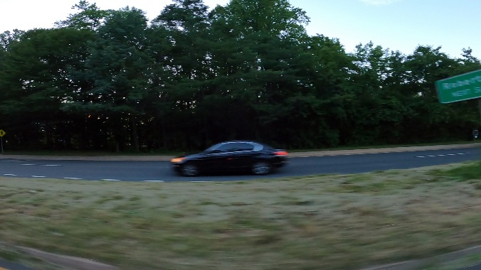
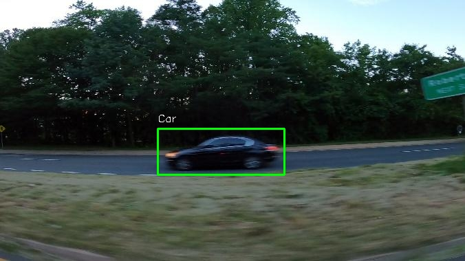

## Car detection  

### Overview
This project provides solution for binary car detection problem, including the data used, the methods and ideas employed. It also includes usage instructions and author information.
### Input:

### Output:


### Data
The dataset used for training and scoring is loaded with pytorch and consists images with and without cars.

[Link to the dataset on Kaggle](https://www.kaggle.com/datasets/sshikamaru/car-object-detection)
## Model Architecture
We use Faster RCNN with resnet50 backbone pretrained on imagenet dataset.
## Usage
### Requirements

- Python 3.10

### Getting Started
Clone repository
```bash
git clone https://github.com/SoulHb/Car-detection.git
```
Move to project folder
```bash
cd Car-detection
```
Install dependencies
```bash
pip install -r requirements.txt
```
### Training
The model is trained on the provided dataset using the following configuration:
- Optimizer: SGD
- Learning rate: 0.001
- Momentum: 0.9
- Weight decay: 0.005
- Image size: (678, 380)
- Batch size: 8
- Number of epochs: 10
- Confidence threshold: 0.5
  
Move to src folder
```bash
cd src
```
Run train.py
```bash
python train.py --dataset_path /path/to/your/dataset \
                --save_model_path /path/to/save/models \
                --epoch 10 \
                --batch_size 8 \
                --lr 0.001 \
                --image_height 678 \
                --image_width 380
```

## Inference
To use the trained model for Car detection, follow the instructions below:

### Without docker:
Move to src folder
```bash
cd src
```
Run Flask api
```bash
python inference.py --model_path /path/to/your/model \
                    --confidence_threshold 0.5
```
Run streamlit ui
```bash
python ui.py
```
Open streamlit ui in browser
```bash
streamlit run /your_path/Car-detection/src/ui.py
```
### With docker:

Run docker-compose
 ```bash
docker-compose -f docker-compose.yml up
```

## Author
Car detection project was developed by Namchuk Maksym. If you have any questions, please contact me: namchuk.maksym@gmail.com
